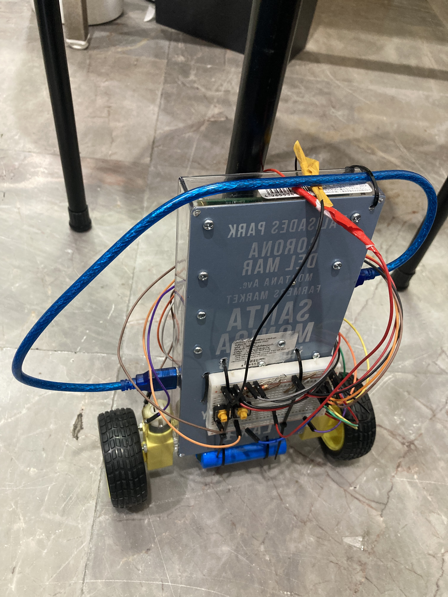
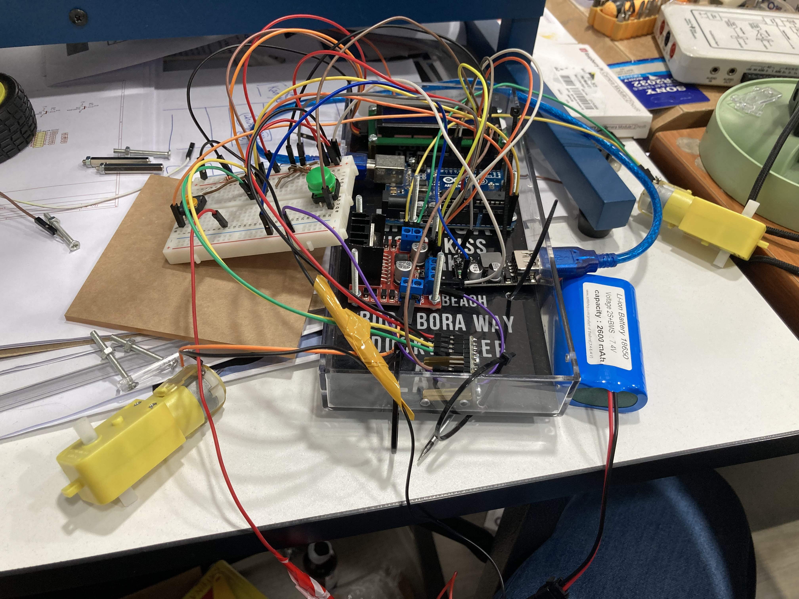

# Self-Balancing-Two-Wheel-Robot

ก่อนที่จะได้หุ่นยนต์ทรงตัวเองนี้ ได้ทำหุ่นยนต์ต้นแบบมาก่อน  
ซึ่งได้แรงบันดาลใจจาก https://circuitdigest.com/microcontroller-projects/arduino-based-self-balancing-robot

โดยหน้าตาหุ่นต้นแบบจะ ทรงตัวไม่ได้และสายไฟ ยังยุ่งเหยิงดังรูปภาพด้านล่าง

<table border="0">
 <tr>
    <td> 
มุมมองด้านหน้า
</td>
    <td> 
การเดินสายไฟ
</td>
 </tr>
 <tr>
    <td> 
ตำแหน่งเซนเซอร์
</td>
    <td> 
ตอนทดสอบวิ่ง
</td>
 </tr>
</table>
