# Self-Balancing-Two-Wheel-Robot with PID Control & Sensor Fusion

https://youtu.be/95e5Ph7vr44

ก่อนที่จะได้หุ่นยนต์ทรงตัวเองนี้ ได้ทำหุ่นยนต์ต้นแบบมาก่อน  
ซึ่งได้แรงบันดาลใจจาก https://circuitdigest.com/microcontroller-projects/arduino-based-self-balancing-robot

โดยหน้าตาหุ่นต้นแบบจะ ทรงตัวไม่ได้และสายไฟ ยังยุ่งเหยิงดังรูปภาพด้านล่าง

<table border="0">
 <tr>
    <td> 
มุมมองด้านหน้า
</td>
    <td> 
ใช้ปุ่มจูน PID
</td>
 </tr>
 <tr>
    <td> 
ใช้ LED บอกสถานะ
</td>
    <td> 
การเดินสายไฟ
</td>
 </tr>
</table>

  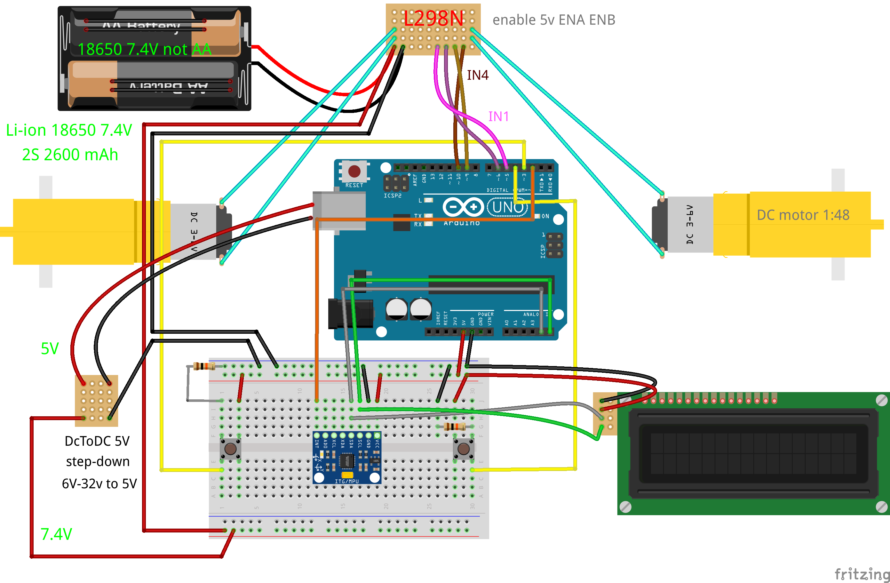

ซึ่งอุปกรณ์ที่ใช้คือ  
Arduino UNO R3  
มอเตอร์ DC gear motor อัตราทด 1:48  
L298N Motor Driver Module  
MPU6050  
ล้อสองข้าง  
7.4V Li-ion Battery  
สาย Jumper  
แผ่นอะคลิลิคแบบไม่สมดุล(จริงๆเป็นถาดวางของ)  
step down dc to dc  

 
สุดท้ายเลยต้อง ออกแบบใหม่
 

<h3> มีบางอุปกรณ์ที่เลือกใช้ใหม่ </h3>

<h4> การออกแบบโครงสร้าง </h4>
โครงทำจาก แผ่นอะคลิริค 10x10 มีประมาณ 6แผ่น  
โครงสร้างใหม่คำนวณการกระจายน้ำหนักและจุดศูนย์ถ่วง Center of Mass(CoM)  
ลดค่า Moment of Inertia (I) ทำให้การจูน PID ทำได้ง่ายขึ้น 
การคำนวณ CoM ให้พอเหมาะไม่สูงและไม่ต่ำเกินไป  ถ้าสูง >> (ควบคุมง่ายแต่ช้า)  ถ้าต่ำ >> (เร็วแต่ล้มไว เหมือนหุ่นยนต์ตัวแรกที่ผมทำเอาแบตเตอรี่ไว้ล่างสุด)   แต่ถ้า CoM สูงเกินมอเตอร์ทำงานหนัก CoM ต่ำเกินระบบไว จูน PID ยาก 
ลด Moment of Inertia โดยการนำมวลหนักๆเข้าใกล้แกนล้อให้มากที่สุด  

<h4> การเลือกมอเตอร์ใหม่ </h4>
จาก มอเตอร์ DC gear motor อัตราทด 1:48 เปลี่ยนเป็นมอเตอร์ JGA25-370 DC6V170RPM 
JGA25-370 เกียร์เป็นเหล็ก metal gearbox แข็งกว่า TT motor ความทนทานสูงกว่าหุ่นยนต์รับน้ำหนักได้มากขึ้น  
JGA25-370 ให้แรงบิดที่มากกว่า TT motor  
JGA25-370 ใช้รุ่นที่รองรับ encoder ถ้าเป็น TT Motor ต้องติดแยกเอง  
ล้อขนาด 6.5 cm (เส้นผ่านศูนย์กลางรวมยางแล้ว) 

<h4> การเลือกมอเตอร์ไดเวอร์ใหม่ </h4>
ไดเวอร์ TB6612FNG ดีกว่า L298N หลายด้าน  
รองรับกระแสสูงสุดได้ถึง 3A สำหรับ L298N 2A  
แรงดันตกคร่อม ต่ำกว่า ทำให้ มอเตอร์แรงกว่า  
TB6612FNG ใช้ MOSFET L298N ใช้ ไบโพลาร์ทรานซิสเตอร์ ทำให้แรงดันตกคร่อมของ TB6612FNG น้อยกว่า  
ความร้อนน้อยกว่า ไม่ต้องติดฮีตซิงก์ ประหยัดพื้นที่มาก  

<h4> การเลือก stepdown dc to dc ใหม่ </h4>
LM2596 แปรงแรงดัน DC to DC รองรับกระแสได้สูง Peak 3A ความร้อนน้อย noise น้อย 

<h4> การ Wire สายไฟ</h4>
มีความสำคัญมาก ! จากหุ่นยนต์ตัวแรก จะค้างบ่อยและชอบรีเซตตัวเองสัญญาณไม่เสถียร  
ซึ่งสายขนาดเล็ก jumper ที่ยาวถึง 20 cm ทำให้แรงดันลดลงและถูก noise รบกวนมาก  
ทำการปรับเป็นสายที่ใหญ่ขึ้นคือ AWG 24 (ไม่เลือกสายที่ใหญ่กว่านี้เพราะจะบัดกรีลงไดเวอร์ยาก)  
แต่สำหรับสายที่ต่อกับเซนเซอร์ใช้ jumper ได้ และสายสัญญาณพวก INA INB PWM ของมอเตอร์ไดเวอร์  
 
แบตเตอรี่์ li-ion 18650 2S+BMS 7.4V 2600mAh (เหมือนเดิม) 
เซนเซอร์ mpu6050 (เหมือนเดิม)  

<table border="0">
 <tr>
    <td>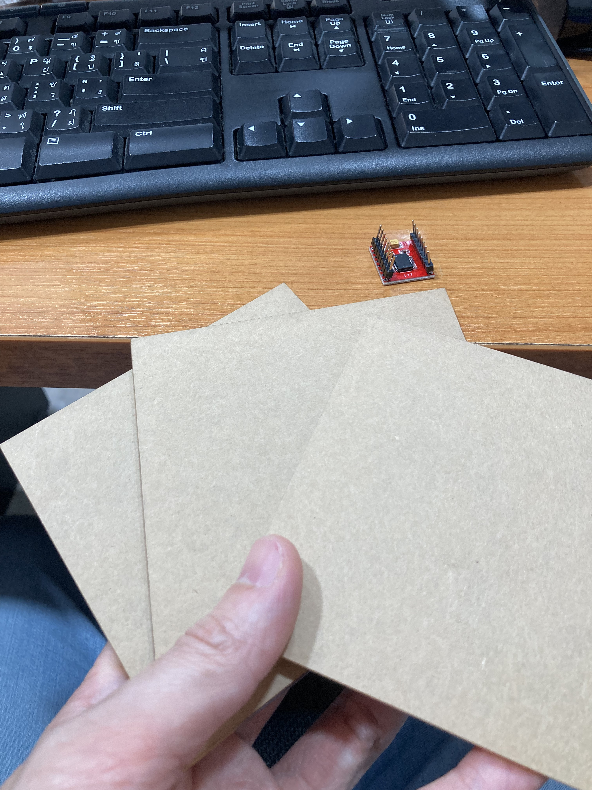 
อะคลิลิค 10x10 
</td>
    <td>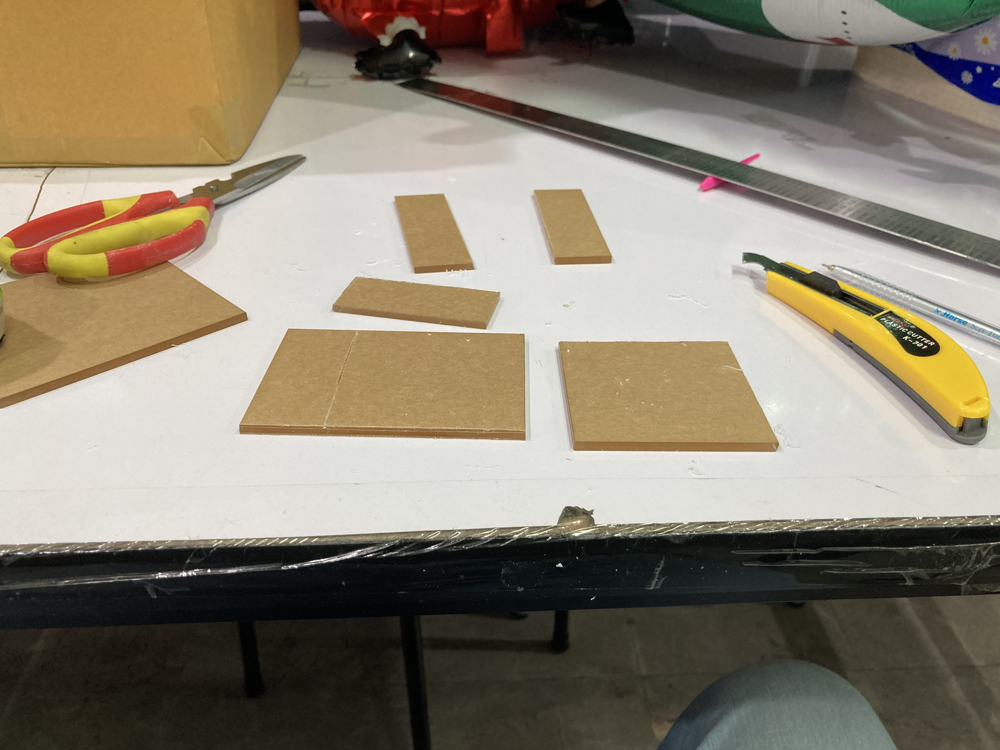 
คัตเตอร์กรีดและหัก
</td>
 </tr>
 <tr>
    <td>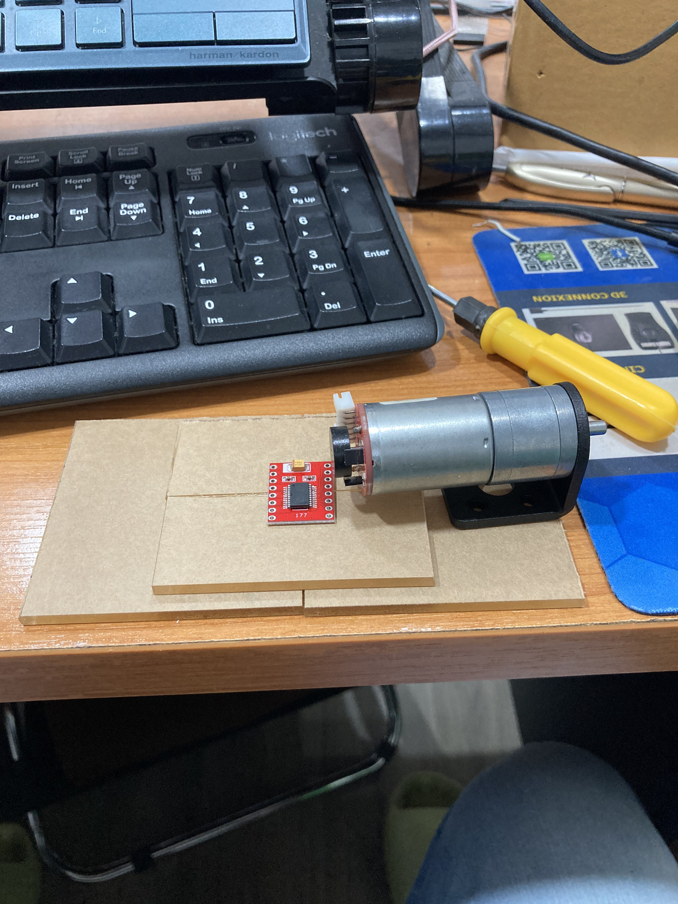 
จัดตำแหน่งชั้น 1
</td>
    <td>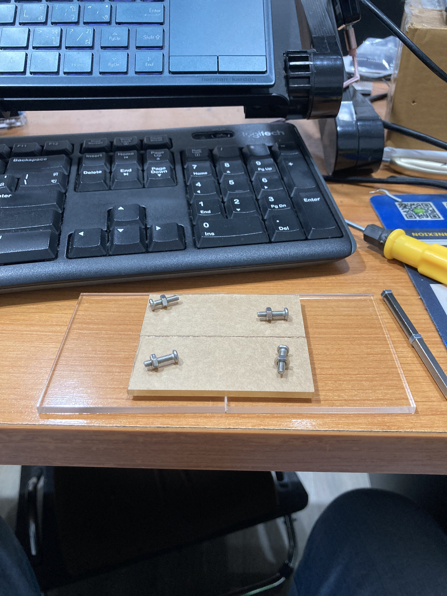 
ยึดน๊อต
</td>
 </tr>
</table>

<table border="0">
 <tr>
    <td>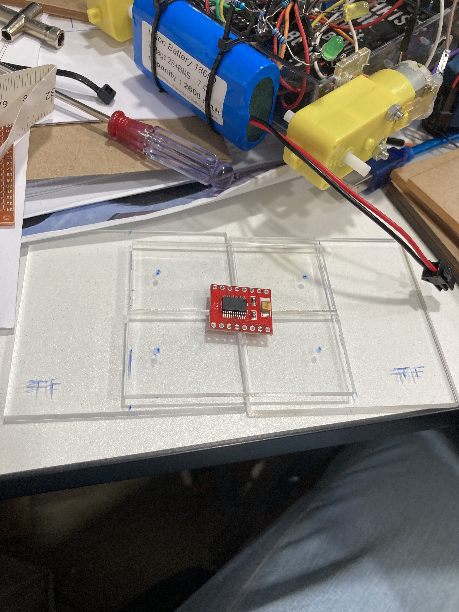 
ตำแหน่งการเจาะรู 
</td>
    <td> 
ต่อชั้น 2
</td>
 </tr>
 <tr>
    <td> 
ต่อชั้น 3
</td>
    <td>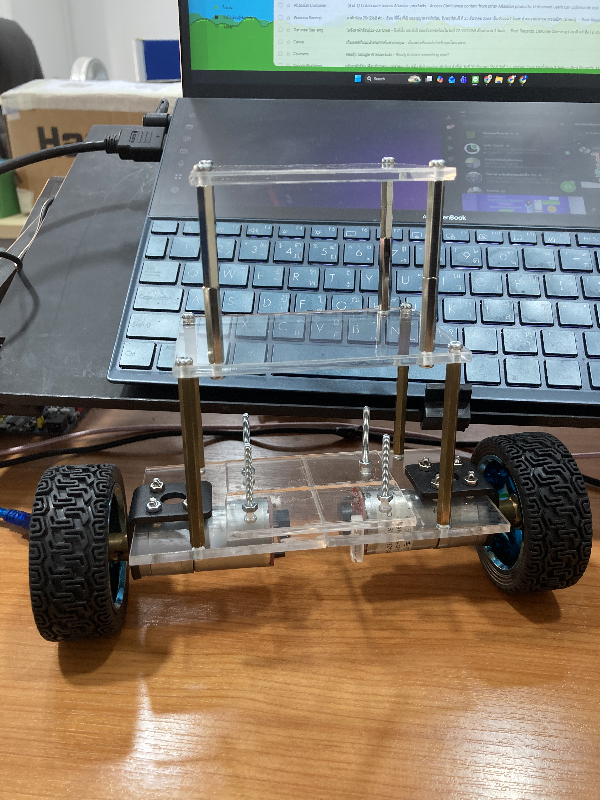 
ใส่ล้อและมอเตอร์
</td>
 </tr>
</table>

<table border="0">
 <tr>
    <td> 
ทดลองวางอุปกรณ์ 
</td>
    <td>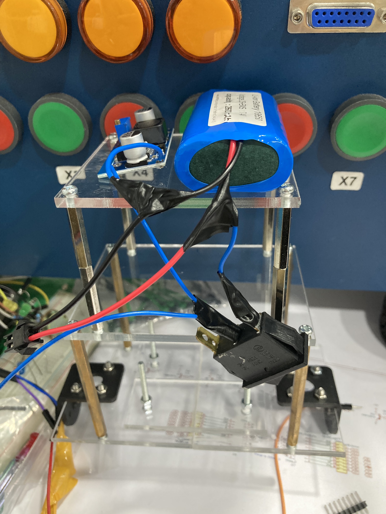 
ทำสวิตช์ เปิด ปิด
</td>
 </tr>
 <tr>
    <td> 
เดินสายไฟ
</td>
    <td>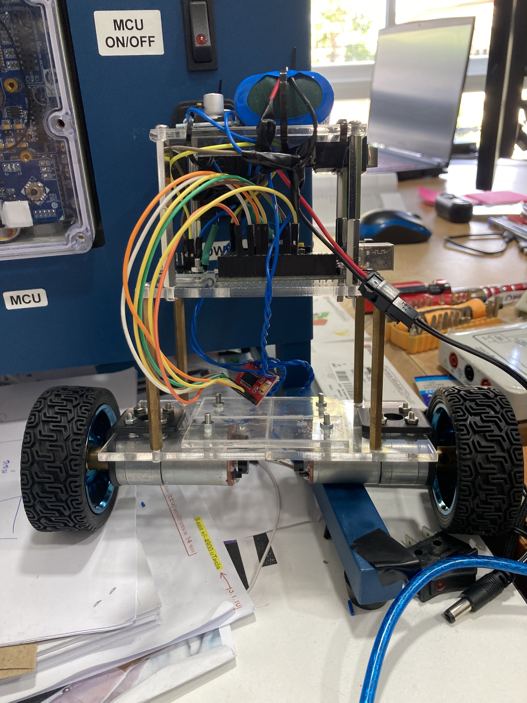 
ต่อสาย jumper
</td>
 </tr>
</table>

  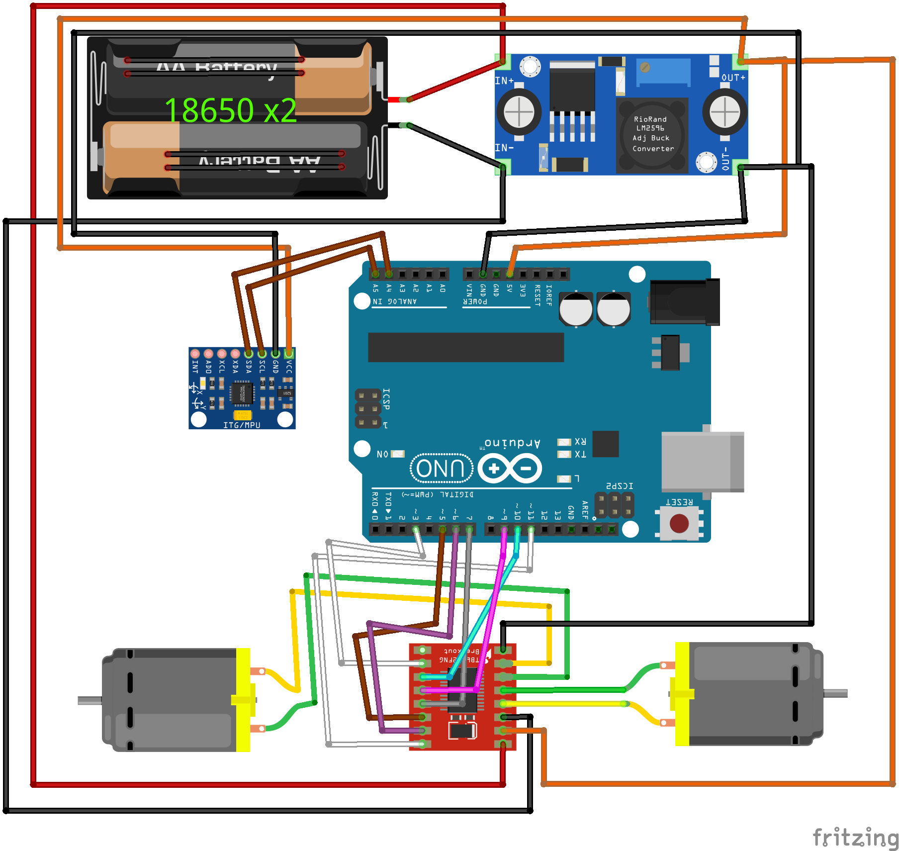

สำหรับการต่อ encoder มีการปรับพินจากภาพด้านบน และมีการต่อเพิ่มจากมอเตอร์ทั้งสองอย่างล่ะ 4 เส้น คือ Vcc, pulseA,pulseB ,GND ซึ่งส่วนปลายซ้ายขวาของ connector คือ M+ M- ที่ต่อเข้ากับมอเตอร์ไดเวอร์

  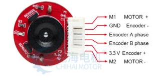

ภาพตัวอย่างลำดับพิน ซึ่งจริงๆใช้ 5v สำหรับ encoder

## 🧠 รายละเอียดการประมวลผล (Technical Note)
ในโปรเจกต์นี้ ผมเลือกใช้ความสามารถของ DMP (Digital Motion Processor) ผ่านไลบรารี I2Cdevlib ของ Jeff Rowberg เพื่อยกหน้าที่การคำนวณ Sensor Fusion ที่ซับซ้อนออกจากหน่วยประมวลผลหลัก (Arduino MCU) ส่งผลให้ระบบสามารถประมาณค่ามุมองศาได้ด้วยความถี่สูง (High-frequency) และมีความหน่วงต่ำ (Low-latency) ซึ่งจำเป็นอย่างมากสำหรับระบบควบคุมการทรงตัวอัตโนมัติ

## 🙏 กิตติกรรมประกาศ (Acknowledgements)
โปรเจกต์นี้มีการใช้งานไลบรารีโอเพนซอร์ส (Open-source libraries) ดังนี้:

I2Cdevlib โดย Jeff Rowberg: ขอขอบคุณเป็นอย่างสูงสำหรับผลงานอันยอดเยี่ยมในการพัฒนาการเชื่อมต่อ MPU6050 DMP (Digital Motion Processor) ซึ่งมีส่วนสำคัญอย่างยิ่งที่ทำให้การคำนวณค่าความเอียง (Tilt estimation) ในโปรเจกต์นี้มีความแม่นยำสูง

